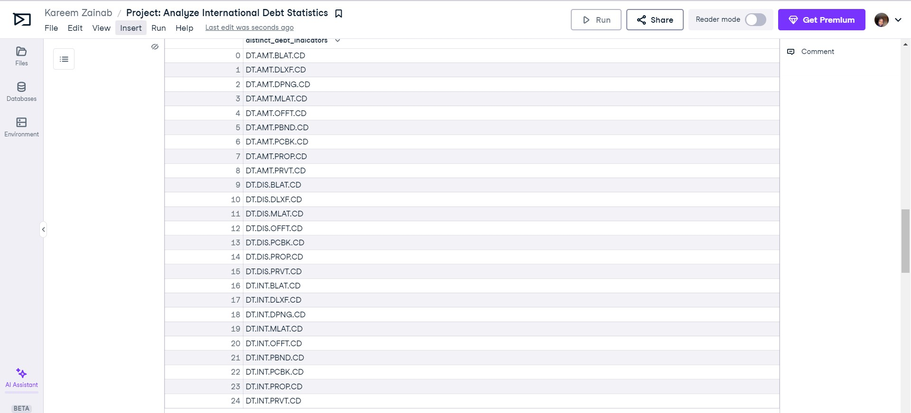
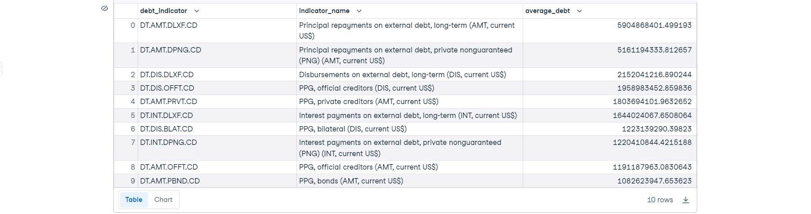

# Analyze-International-Debt-Statistics-

# Introduction
It's not only humans who take on debt to manage their necessities; countries may also incur debt to manage their economies. For instance, infrastructure spending is a significant investment necessary for a country's citizens to lead comfortable lives. The World Bank is an organization that extends loans to countries.

In this project, I will analyze international debt data from The World Bank. The dataset includes information about the amount of debt (in USD) owed by developing countries across various categories.

# Project Objective
The goal of this project is to address questions such as:
1. What is the total amount of debt owed by the countries listed in the dataset?
2. Which country possesses the highest amount of debt, and what is the corresponding figure?
3. What is the average debt amount owed by countries, considering various debt indicators?
 
# Finding the number of distinct countries
The count of distinct countries was used to determine the total number of nations that borrowed money from the World Bank.

# Finding out the distinct debt indicators
The unique column in this table is the Indicator Code. The count of distinct values in this column was utilized to identify the distinct debt indicators. The query results reveal that there are 24 unique debt indicator codes. Consequently, there are only 24 types of debt being issued by the World Bank to various countries.

# Totaling the average amount of debt owed by the countries
The query result indicates that the total average debt owed by the world countries is $3,079,734.49. This translates to three million seventy-nine thousand seven hundred and thirty-four dollars and forty-nine cents.

# Country with the highest debt
The query result indicates that China has the highest debt, amounting to $285,793,494,734.20. In words, this is two hundred eighty-five billion, seven hundred ninety-three million, four hundred ninety-four thousand, seven hundred thirty-four dollars and twenty cents.

# Average amount of debt across indicators
The query result for the average debt per indicator reveals that Principal repayments on external debt, long-term (AMT, current US$) have the highest average value, amounting to $5,904,868,401.50. Conversely, PPG, bonds (AMT, current US$) have the lowest average value for an indicator, standing at $1,082,623,947.65.

# Highest Principal repayment  
The query identified China as the country with the highest principal repayment, and the corresponding debt indicator is "Principal repayments on external debt, long-term (AMT, current US$)." This indicator is also consistent with the average calculation across various debt indicators.

# Conclusion 
In examining international debt statistics from The World Bank, several key insights have emerged. The dataset consists of a diverse range of debt indicators, reflecting the complex financial relationships between countries and global institutions.

The analysis began by determining the total number of distinct countries that borrowed from the World Bank, shedding light on the extent of international financial interactions. With 24 unique debt indicator codes identified, it became evident that a variety of financial instruments are employed by the World Bank to facilitate economic development.

Calculating the average debt owed by countries provided an overview, revealing that the collective average debt stands at $3,079,734.49. This figure underscores the substantial financial commitments made by nations to support their economic growth and infrastructure development.

Delving deeper, the identification of China as the country with the highest debt, amounting to  $285,793,494,734.20, highlights the pivotal role of major economies in the global debt landscape. Understanding such high-stakes financial engagements is important for comprehending the economic dynamics of nations.

Analyzing the average debt across different indicators brought attention to the varied nature of financial instruments. Notably, "Principal repayments on external debt, long-term (AMT, current US$)" emerged as the indicator with the highest average value, indicating the significance of this financial component in international transactions.

Moreover, the correlation between China having the highest principal repayment and the corresponding debt indicator aligns with the broader trend observed across various debt indicators.

In essence, this project underscores the complexity and diversity of international debt, emphasizing the role it plays in shaping the economic landscapes of individual nations and the global community as a whole.
   
